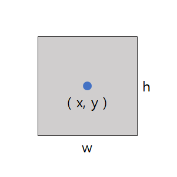
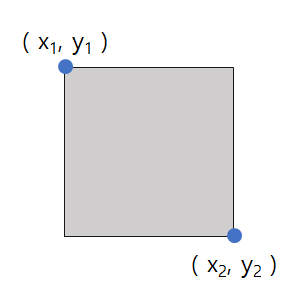
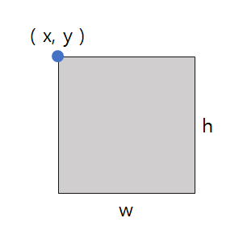

<!-- ---
layout: post
title: "Object Detection Bbox 좌표"
subtitle: "데이터셋 좌표 특징 및 변환"
date: 2022-08-16 11:00
background: 
tag: [Tips, Github io, Notion]
--- -->

# Object Detection Bbox 좌표

## COCO 형식

**(x, y, w, h) - bbox값**



## YOLO 형식

**(x, y, w, h) - 비율값
center coordinates**



## KITTI, VOC 형식

**(x1, y1, x2, y2) - bbox값
corner coordinates**



## COCO **Converting**

```python
# Convert COCO to Pascal_VOC
def coco_to_voc(x, y, w, h):
	return [x1, y1, x+w, y+h]

# Convert COCO to YOLO
def coco_to_yolo(x, y, w, h, image_w, image_h):
	center_x = (2*x + w)/(2*image_w)
	center_y = (2*y + h)/(2*image_h)
	return [center_x, center_y, w/image_w, h/image_h]
```

## YOLO Converting

```python
# Convert YOLO to COCO
def yolo_to_coco(x_center, y_center, w, h, image_w, image_h):
	w = w*image_w
	h = h_image_h
	x = ((2*x_center*image_w) - w)/2
	y = ((2*y_center*image_h) - h)/2
	return [x, y, w, h]

# Convert YOLO to VOC
def yolo_to_voc(x_center, y_center, w, h, image_w, image_h):
	w = w*image_w
	h = h*image_h
	x1 = ((2*x_center*image_w) - w)/2
	y1 = ((2*y_center*image_h) - h)/2
	x2 = x1 + w
	y2 = y1 + h
	return [x1, y1, x2, y2]
```

## VOC Converting

```python
# Convert VOC to COCO
def voc_to_coco(x1, y1, x2, y2):
	return [x1, y1, x2-x1, y2-y1]

# Convert VOC to YOLO
def voc_to_yolo(x1, y1, x2, y2, image_w, image_h):
	center_x = (x2 + x1)/(2*image_w)
	center_y = (y2 + y1)/(2*image_h)
	w = (x2 - x1)/image_w
	h = (y2 - y1)/image_h
	return [center_x, center_y, w, h]
```
